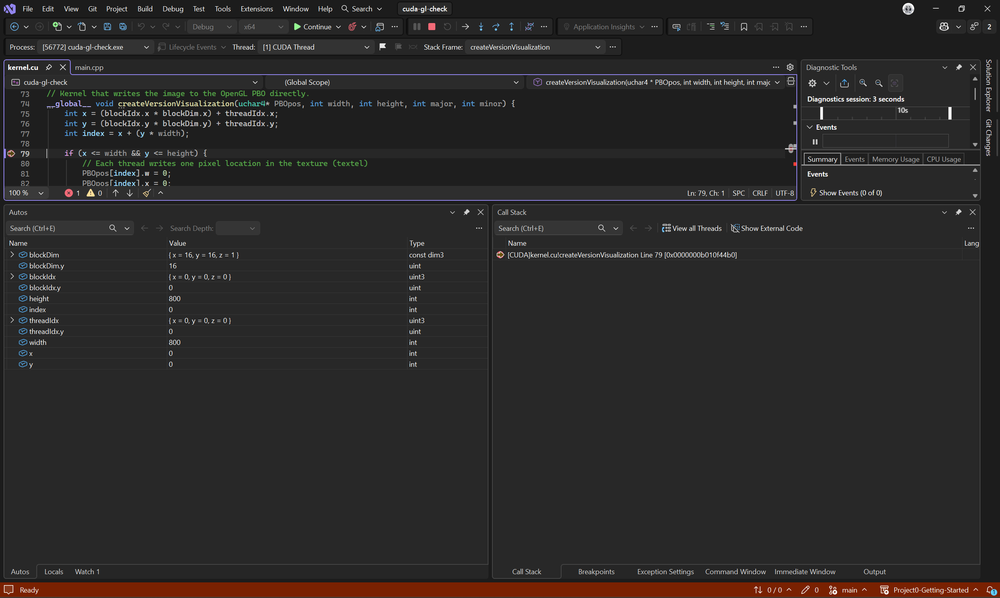
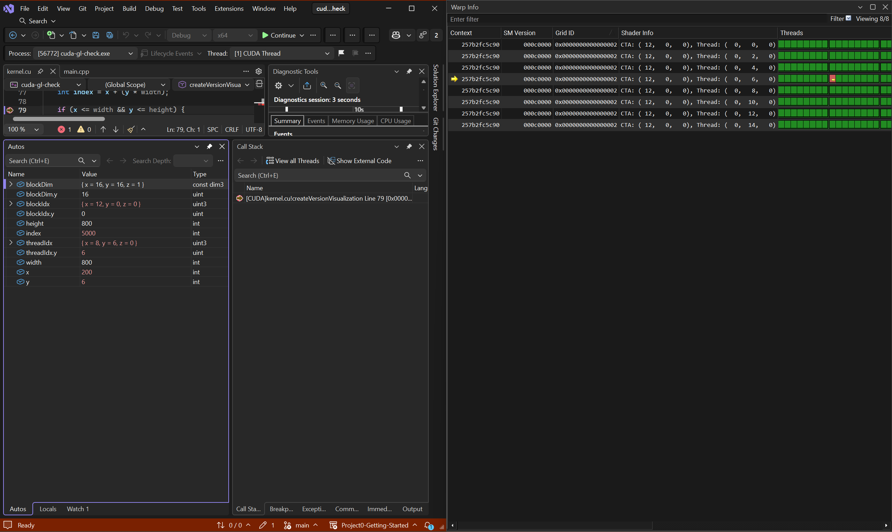
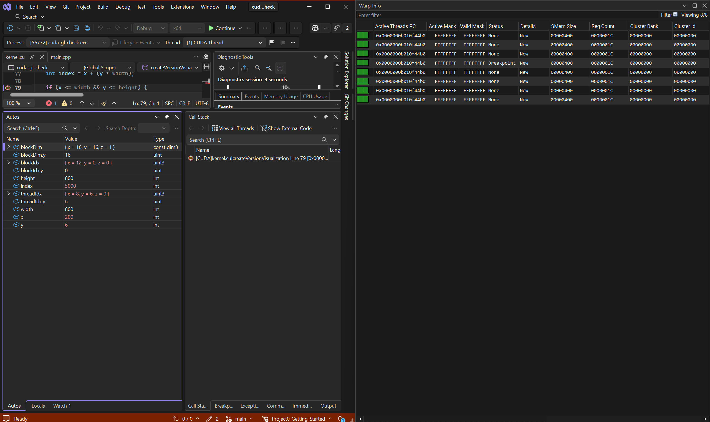
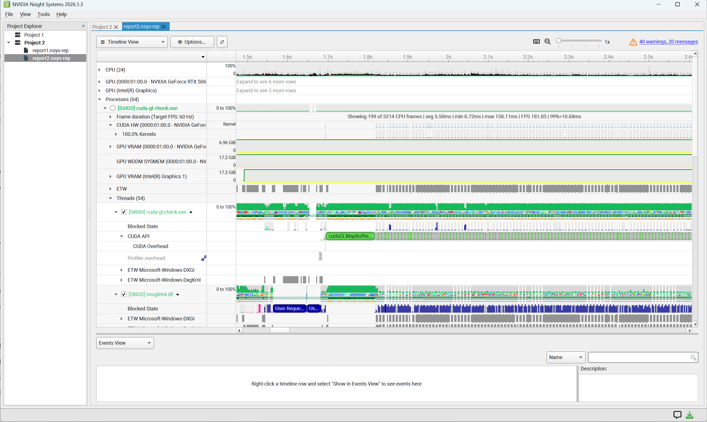
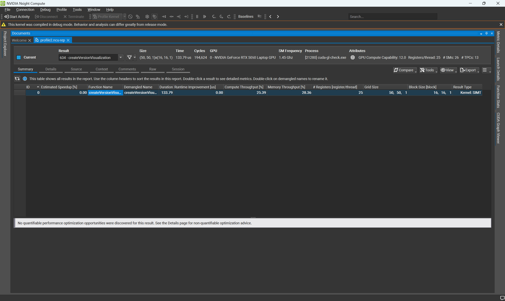
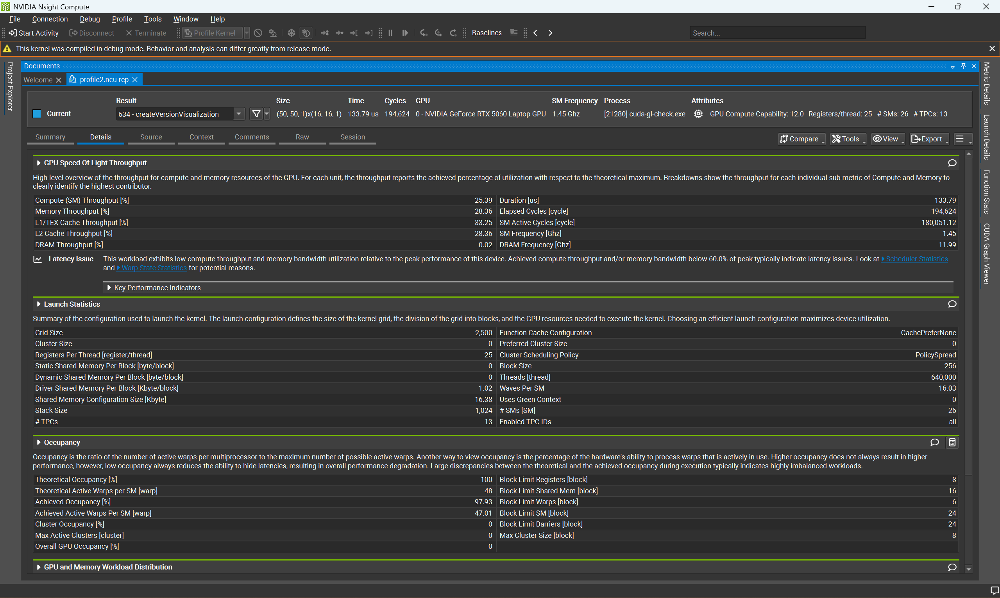
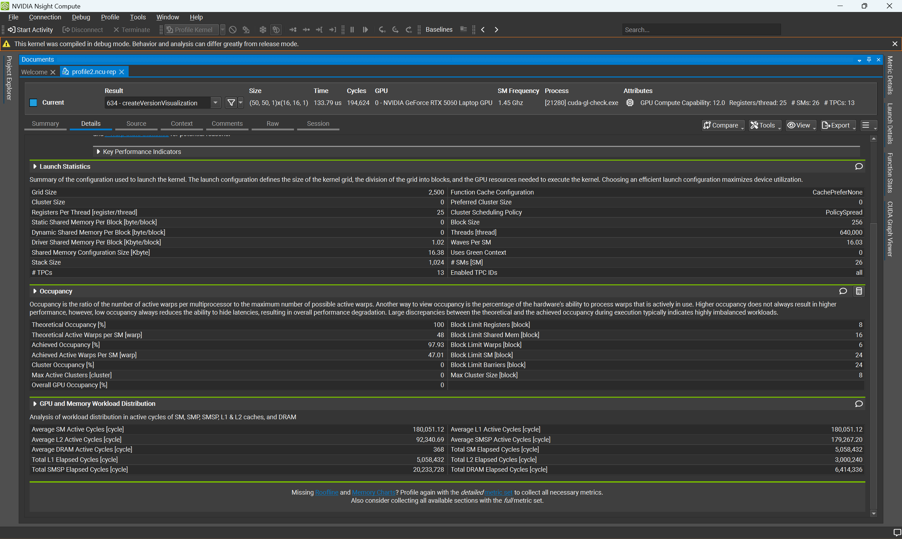
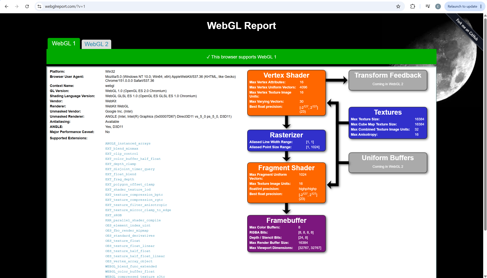
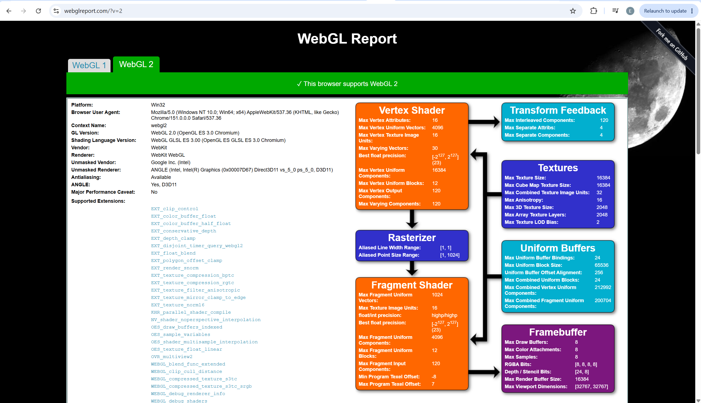
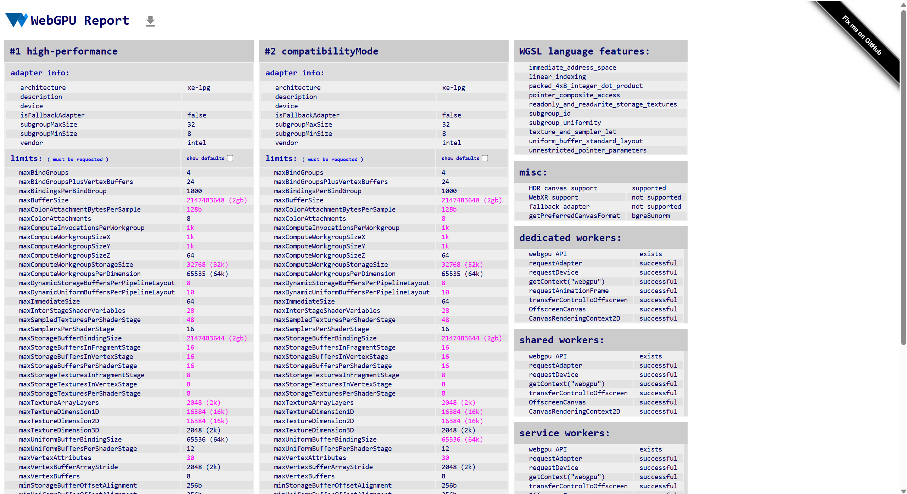

Project 0 Getting Started
====================

**University of Pennsylvania, CIS 5650: GPU Programming and Architecture, Project 0**

* Ethan Yang
  * github.com/eyang72004
* Tested on: Windows 11, NVIDIA GeForce RTX 5060 Laptop GPU (Personal Computer)
* CUDA Compute Capability: 12.0

## CUDA / OpenGL

Got the CUDA/OpenGL check running on my laptop.

## Nsight Debugging

I used Nsight Visual Studio Edition to step through the CUDA kernel, inspect thread/block values, and try a conditional breakpoint.

## Nsight Systems

I ran the CUDA/OpenGL program through Nsight Systems and looked through the timeline and CUDA activity.

## Nsight Compute

I profiled the `createVersionVisualization` kernel using Nsight Compute.

## WebGL

WebGL 1 and WebGL 2 both work on my machine.

## WebGPU

WebGPU also works on my machine.

